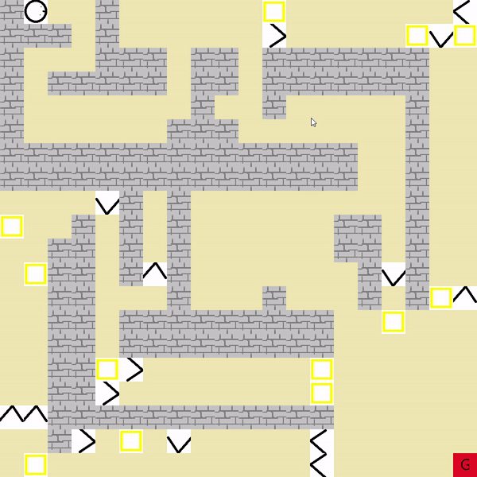

# comp2012h_pa5_group20-Maze Game
# Introdution
This is a C++ with Qt GUI tools project. In this project, we take the advantage of some OOP concept such as inheritance and having a practice with GUI programming and event handling. Also, we implemented a BFS algorithm for find a shortest path.
[]
